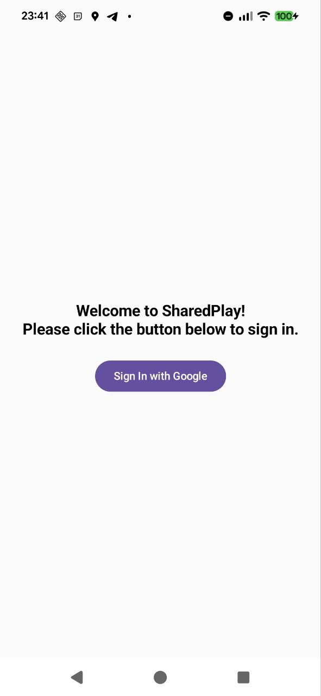
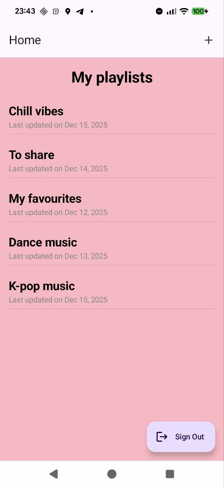
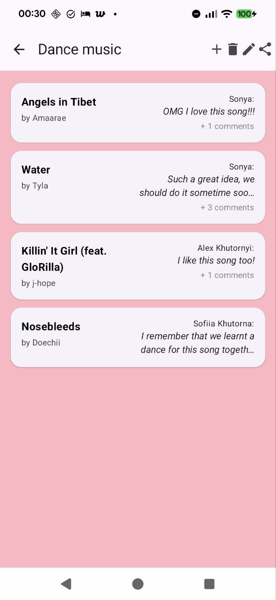
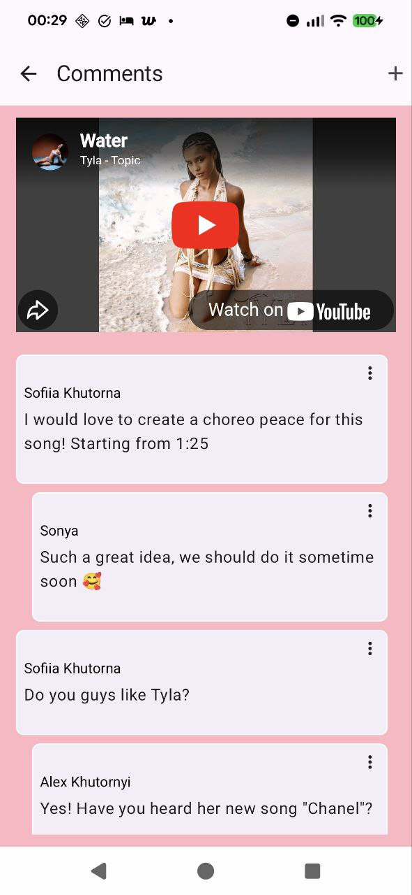
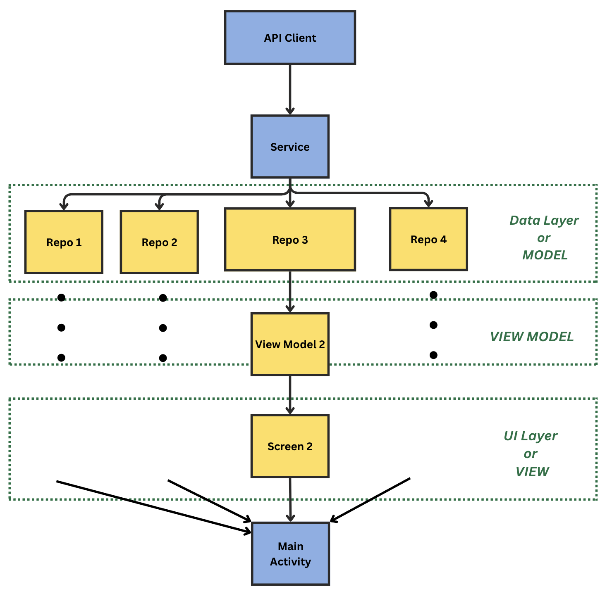

# Shared Play

Shared play is an Android app that allows users to create and share playlists, as well as leave private comments on individual songs or music videos within a playlist. 
Friends can listen to the same music and also share their impressions and reactions in a private, video-specific thread. 

## Features

- User sign in through verified Google account
- Create playlists and add songs or videos though YouTube link
- Add your friends as collaborators for a playlist using unique invite deep-link
- View and post comments
- Pull-to-refresh content

## App Screenshots

Shared play currently has four different screens that each serve a distinct purpose. You can take a look at the screenshots below for better understanding.

| Sign In | Home | 
|------------|------------|
|  |   | 

The **Sign-In** screen appears only if the user is not authenticated, showing a welcome message and asking them to sign in with Google. Once signed in, the user is taken to the **Home** screen, which serves as the main entry point of the app. It shows the list of all playlists the user has access to, date when they were last updated, as well as the “Sign Out” button in the bottom right corner. 

|Playlist Details | Comments | 
|------------|------------|
|  |   | 

Clicking on a specific playlist leads to the **Playlist Details** screen. This screen displays information specific to the selected playlist, including the list of songs it contains, the most recent comment for each song, and the total number of comments associated with that song.
From there, selecting an individual song opens the **Comments** screen, which has two main goals: allowing the user to play the song or video through the embedded YouTube player, and viewing the comment section where other editors can leave private comments and chat with each other.

All screens also support core operations such as adding, editing, sharing, and deleting objects through icons available in the TopAppBar. Navigation between screens is handled using NavController, a component of Jetpack Compose. NavController allows navigation paths and enables passing data between screens while tracking the user’s current location within the app.

## Tech Stack

- **Language:** Kotlin
- **Framework:** Android
- **UI:** Jetpack Compose
- **Architecture:** MVVM
- **Navigation:** Navigation Compose
- **Backend:** Custom REST API (https://github.com/sofiiak13/BackendSharedPlay)
- **Authentication:** Firebase Auth
- **Networking:** Retrofit + OkHttp

